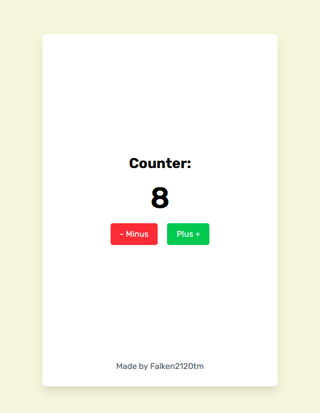

# Counter — A Simple Counter App with Next.js / Простое приложение-счётчик на Next.js



This project is built using [Next.js](https://nextjs.org) and was bootstrapped with [`create-next-app`](https://nextjs.org/docs/app/api-reference/cli/create-next-app).

Проект создан с помощью [Next.js](https://nextjs.org) и инициализирован через [`create-next-app`](https://nextjs.org/docs/app/api-reference/cli/create-next-app).

---

## 📌 Description / Описание

**EN:**  
**Counter** is a minimal web application that allows the user to increment and decrement a number by 1. It demonstrates basic state handling in React with modern features of Next.js.

**RU:**  
**Counter** — это минималистичное веб-приложение, позволяющее пользователю увеличивать и уменьшать значение счётчика на 1. Показывает основы работы с состоянием в React и современные возможности Next.js.

---

## 🚀 Getting Started / Начало работы

**EN:**  
To run the development server:

```bash
npm run dev
# or
yarn dev
# or
pnpm dev
# or
bun dev
